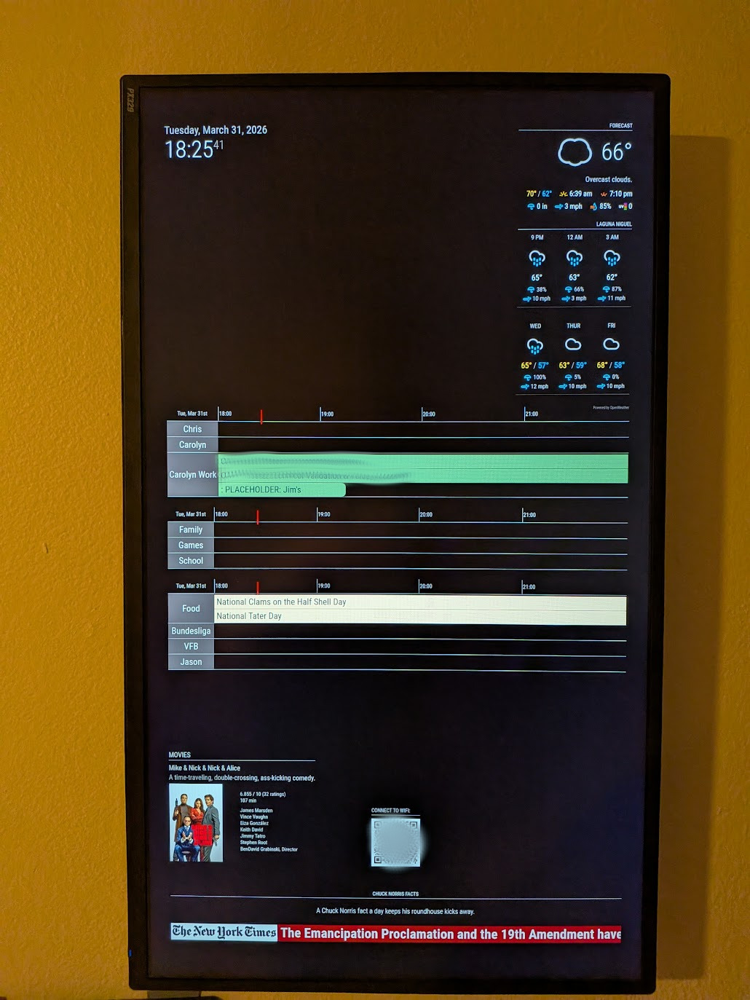
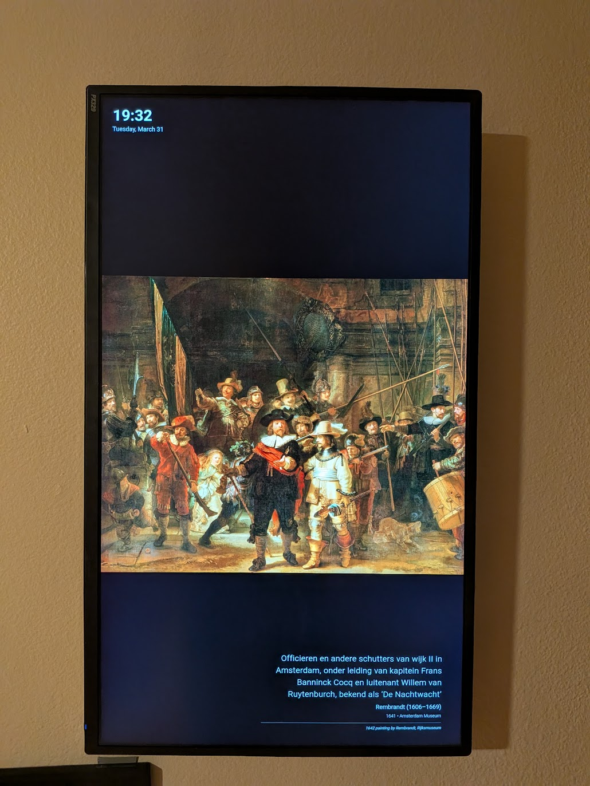

# MMM-Art

A [MagicMirror²](https://magicmirror.builders/) module that transforms your mirror into a digital art gallery. It fetches high-quality artwork from [Wikidata](https://www.wikidata.org/) and displays it on a scheduled interval, hiding other modules to provide a clean, "framed" art experience.





*(Example: Rembrandt's "The Night Watch" - [Q219831](https://www.wikidata.org/wiki/Q219831) 

## Features

- **Full-Screen Art Mode**: Cycles between displaying artwork and your normal mirror interface.
- **Rich Metadata**: Displays artwork title, artist (with birth/death dates), creation date, and collection information.
- **Smart Transitions**: Automatically hides other modules when the art is active to focus on the piece.
- **Integrated Clock**: Keeps the time and date visible even in Art Mode.
- **Local Caching & Resizing**: 
    - Downloads images to a local cache to ensure smooth loading.
    - Automatically resizes huge high-resolution images to match your screen's resolution, preventing browser crashes and improving performance.
    - Uses `sharp` (primary) or `ImageMagick` (fallback) for image processing.
- **Background Fetching**: Fetches and prepares images in the background so your mirror stays responsive.

## Installation

1. Navigate to your MagicMirror's `modules` folder:
   ```bash
   cd ~/MagicMirror/modules
   ```
2. Clone this repository:
   ```bash
   git clone https://github.com/christian-klein/MMM-Art
   ```
3. Navigate to the `MMM-Art` folder and install dependencies:
   ```bash
   cd MMM-Art
   ```
4. Install the required Node.js packages:
   ```bash
   npm install
   ```

> [!NOTE]
> For image resizing, this module uses `sharp`. If `sharp` is unavailable on your system architecture, it will attempt to use `ImageMagick` (requires `convert` command to be available).

## Configuration

Add the module to your `config/config.js` file:

```javascript
{
    module: "MMM-Art",
    position: "fullscreen_above", // Recommended position
    config: {
        artworkList: [
            'Q219831',    // The Night Watch (Rembrandt)
            'Q15461864',   // The Large Blue Horses (Franz Marc)
            'Q12418',    // Mona Lisa (Da Vinci)
            'Q33082',    // Girl with a Pearl Earring (Vermeer)
            'Q5582',     // The Starry Night (Van Gogh)
        ],
        activeDuration: 60 * 1000,   // Show art for 60 seconds
        inactiveDuration: 30 * 1000, // Return to mirror for 30 seconds
        animationSpeed: 1000,       // Fade in/out speed
        showMetadata: true,         // Show/hide artwork info
        slideChangeThreshold: 3      // Number of active cycles before switching to the next piece
    }
}
```

### Config Options

| Option | Default | Description |
| --- | --- | --- |
| `artworkList` | `['Q15461864']` | Array of Wikidata IDs (Q-numbers) to cycle through. |
| `activeDuration` | `30000` | How long (in ms) to display the artwork. |
| `inactiveDuration` | `30000` | How long (in ms) to hide the artwork and show other modules. |
| `animationSpeed` | `1000` | Duration of the fade transition (in ms). |
| `showMetadata` | `true` | Whether to display the title, artist, and details overlay. |
| `slideChangeThreshold` | `3` | How many times the art should reappear before switching to the next item in the list. |

## How it Works

1. **Data Fetching**: The module uses a SPARQL query to fetch metadata and original image URLs from Wikidata.
2. **Background Caching**: The `node_helper` downloads the original images and resizes them to the screen's resolution.
3. **Display Cycle**:
   - **Active State**: The module hides all other MagicMirror modules and fades in the artwork.
   - **Inactive State**: The module fades out the artwork and shows all other modules.
4. **Resiliency**: Includes a "lock" system to prevent re-processing failed images and uses the resolution reported by the browser to optimize image size.

## How to Add Your Own Artwork

This module uses **Wikidata IDs (Q-numbers)** to fetch artwork. You can easily find the ID for almost any famous painting in the world:

1.  Go to [Wikidata.org](https://www.wikidata.org/).
2.  Search for the name of the painting (e.g., *"Starry Night"* or *"The Kiss"*).
3.  Look for the code starting with **Q** next to the title (e.g., `Q5582` for *The Starry Night*).
4.  Copy this ID and add it to your `artworkList` array in `config.js`.

### Tips
- You can add as many IDs as you like to the list.
- Paintings are downloaded and resized and will show an empty screen until that process has finished, which can take a while on slower systems.

## License

This project is licensed under the MIT License - see the [LICENSE](LICENSE) file for details.
